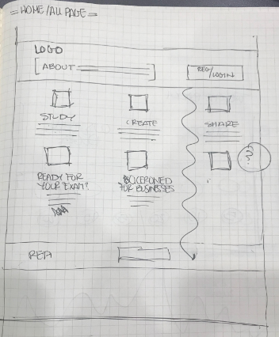
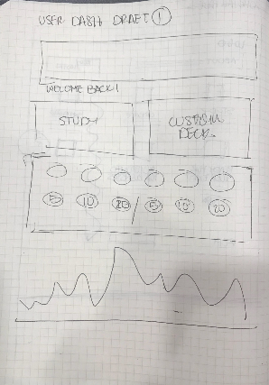
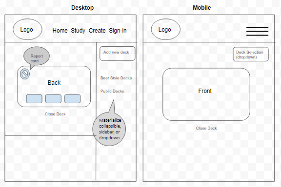
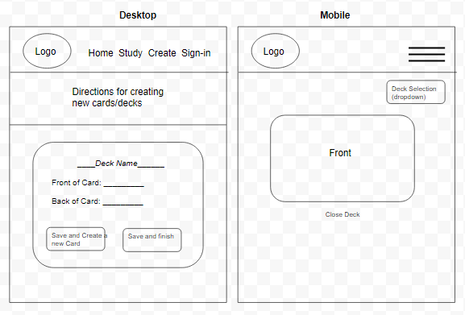

# Cicerowned

## Deliverable 1

#### GitHub: https://github.com/allenjwelch/cicerowned_project
#### Heroku: https://cicerowned.herokuapp.com/

## Overview
  An educational web application designed to assist servers and beer drinkers alike in their pursuit of earning their Cicerone Certifications. There are solutions out there for wine certifications but not a lot of accessible test aids for Cicerone. This would be useful to most breweries and restaurants as they seek to develop employees to the first level of Cicerone.

## Detailed Design Layouts with annotations describing all UI/UX components and all data relevant to each screen

## Breakdown of roles by group member
* Wireframe (Susan)
  - NavBar Component (Susan)?
  - Header Component (Susan)
  - Footer Component (Susan)
* Design Badges (Susan)
  - Badge Banner Component
* Mongo DB structure (Eddie)
  - userController & userModel (Eddie)
  - beerStylesController & beerStylesModel (Eddie)
  - customCardController & customCardModel (Eddie)
* Flashcard Page (Allen)
  - Flashcard Component (Allen)
* Custom Card Page (Allen)
  - Custom Card Form Component (Allen)
* Beer Style seed Data (Allen)
  - update json & seedDB
* User Profile Page
  - User Progress Chart Component (Eddie)
* Research Auth0 and practice (All)
  - SignIn Component
* Server setup and Routing (All)

- React Front End (All)

## Schedule of completion of various tasks
* July 7 - Auth0 Check-in, basic pages, page routes, api routes, flashcards components
* July 9 - data models, API (MVP in place?)
* July 10 [Deliverable 2]
* July 14 - CSS, styling
* July 16 - (Deploy)
* July 17 [Deliverable 3]
* July 21 - Deploy
* July 24 [Deliverable 4]

## Screen shot of Project Management Board

### Devilerable Schedule
1. July 3: Plan, Design, Research
2. July 10: Ready MVP, Mini-Presentation
3. July 17: Project Polish, Functionality Push, Final Plan
4. July 24: Final Presentation

# Deliverable 2

## Deliverables

- *Deliverable 1*
  - Create a file called `index.md` in your `docs` folder at the root of your project.
  - Using markup, write to your `index.md` file the following:
    - Overview of the intended application, and why you feel it's valuable.
    - A breakdown of roles by group member.
    - A schedule for completion of various tasks.
    - A screenshot of your Jira, Trello, or Project Management Board that shows breakdown of tasks assigned to group members with a schedule.
    - A set of DETAILED screen-by-screen design layouts with annotations describing all UI/UX components and all data relevant to the screen.
  - Add the `docs` folder and file(s) to your repo, and push it to the GitHub repository you will use for your final project.
  - Set up GitHub pages to publish this documentation [like this](https://blog.github.com/2016-08-22-publish-your-project-documentation-with-github-pages/)

You may also put these requirements in separate markdown files and link to them, if you so choose.

- *Deliverable 2*
  - Add another screenshot of your Jira, Trello, or Project Management Board that shows breakdown of tasks assigned to group members with a schedule to your `docs` markdown file. This should be updated to reflect remaining priorities and completed tasks.
  - You should also have a link to your MVP project on Heroku listed somewhere in your repository.  Probably best if you add it to the Description at the top of the repo page on GitHub.

- *Deliverable 3*
  - Add the following to your docs folder (either in the same `index.md` file, or a separate markdown file):
    - A summary of significant issues faced to date and their resolution.
    - A detailed description of each person's contributions.
    - A detailed plan that describes remaining efforts. This should describe remaining issues like:
      - Stretch Features
      - Bugs
      - Enhancements
      - UI Polishing

- *Deliverable 4*
  - Update your `README.md` to describe your project, how to run it, protocol for making changes, deployment links, etc, prior to presentation day.